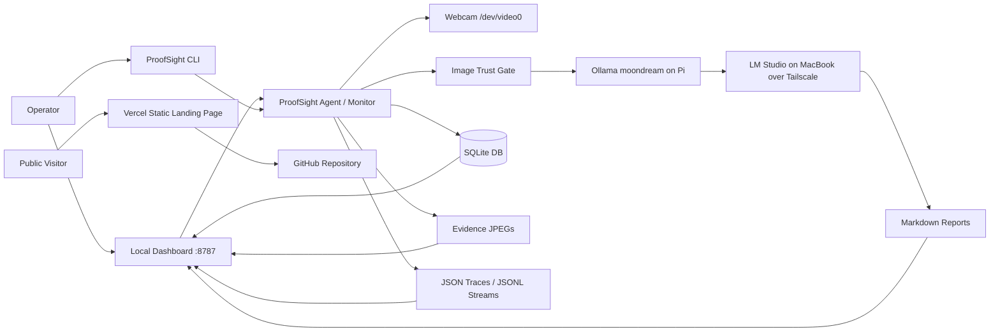
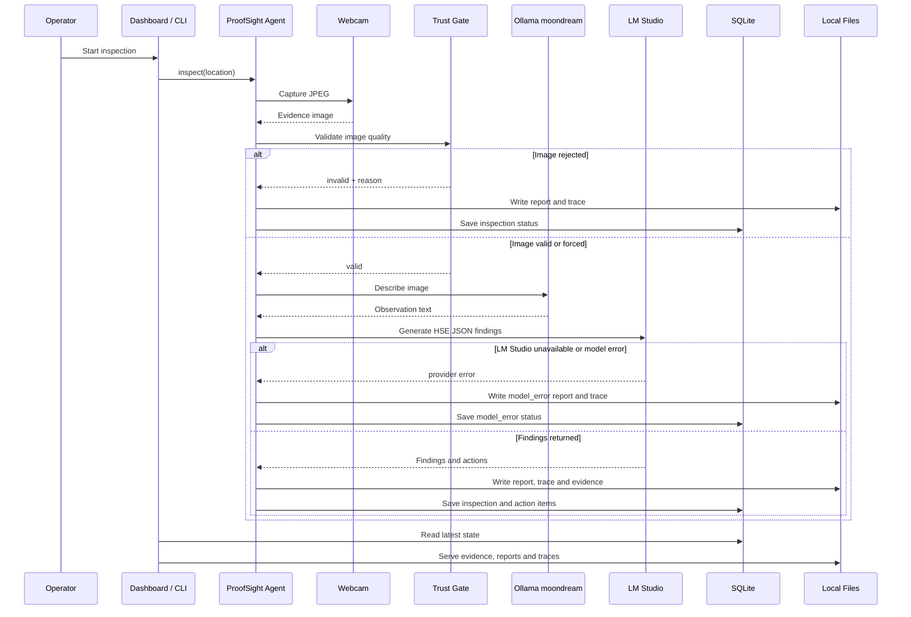

# System Architecture: ProofSight

## Overview

ProofSight is a local-first health and safety inspection appliance for a Raspberry Pi 5. It captures visual evidence from a webcam, validates whether that evidence is usable, runs Pi-local vision through Ollama, sends reasoning and report decisions to LM Studio on a MacBook over Tailscale, generates inspection reports and action items, and exposes the result through a local dashboard.

The deployed runtime is intentionally edge-oriented. The Raspberry Pi owns camera access, evidence validation, evidence storage, the SQLite database, reports, traces, partner-aligned JSONL artifacts and the dashboard. The MacBook LM Studio service is a trusted LAN/Tailscale reasoning dependency. If that dependency is unavailable, ProofSight records `model_error` rather than silently falling back or inventing findings.

A static Vercel landing page exists for public project presentation. It is not the operational dashboard and does not expose camera access, local reports, SQLite data or systemd controls.

## Key Requirements

- Run on a Raspberry Pi 5 with local storage.
- Capture evidence from a local webcam at `/dev/video0`.
- Validate evidence quality before model inference.
- Reject dark, blank, obstructed or suspiciously small images by default.
- Use Pi-local Ollama for vision.
- Use LM Studio over Tailscale for reasoning and report decisions in the current deployment.
- Generate human-readable Markdown reports.
- Store inspection metadata, action items and review states in SQLite.
- Keep evidence, traces and partner-aligned artifacts on-device.
- Provide a dashboard for operations, reporting, human review and audit-pack export.
- Require human review before relying on AI-generated findings for formal compliance decisions.
- Keep the public Vercel deployment separate from the private Pi runtime.

## High-Level Architecture



The private runtime path is the Pi appliance and trusted MacBook reasoning service. The public Vercel path is only a static project page backed by the GitHub repository. This boundary is important because the operational dashboard currently has no authentication and serves local inspection data.

## Component Details

### ProofSight CLI and Monitor

- **Responsibilities:** Run one inspection, run repeated inspections, show partner status, initialise directories and database tables.
- **Main technologies:** Python 3.13, `argparse`, `sqlite3`, `subprocess`, `urllib.request`, PyYAML.
- **Data owned or transformed:** Inspection IDs, image paths, validation results, model responses, findings, reports and traces.
- **External dependencies:** `ffmpeg`, `v4l2-ctl`, Ollama HTTP API, LM Studio OpenAI-compatible API.
- **Failure modes or operational concerns:** Camera capture can fail, Ollama can be unavailable, LM Studio can be unreachable, models can return unparseable JSON, and dark frames are intentionally rejected.

Main files:

```text
proofsight.py
vasper_qa.py
config.yaml
```

`proofsight.py` is the current command entry point. `vasper_qa.py` remains as the implementation and compatibility path so older commands and imports do not break.

### Camera Capture

- **Responsibilities:** Configure the webcam and capture one JPEG evidence frame.
- **Main technologies:** V4L2, `v4l2-ctl`, `ffmpeg`.
- **Data owned or transformed:** Raw camera frame saved as a JPEG evidence file.
- **External dependencies:** Local webcam at `/dev/video0`.
- **Failure modes or operational concerns:** Privacy shutter, low light, exposure settings, unavailable device, busy device or malformed camera output.

Current camera configuration:

```yaml
camera:
  device: /dev/video0
  width: 1280
  height: 720
  framerate: 10
  warm_frames: 20
  power_line_frequency: 1
```

### Image Trust Gate

- **Responsibilities:** Reject unusable evidence before model inference.
- **Main technologies:** Pillow image loading and statistics.
- **Data owned or transformed:** File size, resolution, mean RGB, pixel extrema, validity and rejection reason.
- **External dependencies:** None beyond local image file access.
- **Failure modes or operational concerns:** Thresholds may reject borderline low-light images. This is intentional for a trusted evidence workflow but may require tuning per site.

Current validation thresholds:

```yaml
validation:
  min_mean_brightness: 30
  min_file_size_bytes: 25000
  reject_blank_or_dark: true
```

Common rejection reason:

```text
image_too_dark_or_obstructed
```

### Model Layer

- **Responsibilities:** Describe valid images and convert observations into structured HSE findings and actions.
- **Main technologies:** Ollama HTTP API at `http://127.0.0.1:11434/api/generate` for `moondream` vision; LM Studio OpenAI-compatible API at `http://<MACBOOK_TAILSCALE_IP>:1234/v1/chat/completions` for reasoning.
- **Data owned or transformed:** Image description text, structured JSON findings and action plans.
- **External dependencies:** Pi-local Ollama service, MacBook LM Studio server reachable over Tailscale, installed LM Studio model.
- **Failure modes or operational concerns:** Slow inference on Pi CPU, unreachable MacBook LM Studio server, wrong LM Studio model ID, timeout, unparseable JSON or hallucinated findings. Provider failures are recorded as `model_error`.

Current model configuration:

```yaml
models:
  scenario: B_pi_camera_macbook_lmstudio
  provider: lmstudio
  ollama_base_url: http://127.0.0.1:11434
  vision: moondream
  lmstudio_base_url: http://<MACBOOK_TAILSCALE_IP>:1234/v1
  reasoning: local-model
  report: local-model
```

### Report and Action Generation

- **Responsibilities:** Write Markdown inspection reports and save action items for visible findings.
- **Main technologies:** Python file writing, SQLite.
- **Data owned or transformed:** Markdown reports, findings JSON, action items.
- **External dependencies:** Local filesystem and SQLite database.
- **Failure modes or operational concerns:** Model findings may be incomplete, over-cautious or need human correction. Reports are draft inspection outputs.

Reports are stored in:

```text
/home/dave/hse-pi-agent/reports
```

### SQLite Data Store

- **Responsibilities:** Store canonical inspection rows, action items and dashboard review states.
- **Main technologies:** SQLite.
- **Data owned or transformed:** Inspections, action items and dashboard reviews.
- **External dependencies:** Local disk.
- **Failure modes or operational concerns:** No migration framework exists yet. Schema changes are currently created by application startup code.

Database path:

```text
/home/dave/hse-pi-agent/data/proofsight.db
```

### Dashboard and Reporting UI

- **Responsibilities:** Serve operations dashboard, reporting dashboard, evidence/report/trace views, review controls and audit-pack exports.
- **Main technologies:** Python standard library `ThreadingHTTPServer`.
- **Data owned or transformed:** HTML pages, JSON status payloads, CSV reports and ZIP exports.
- **External dependencies:** Local filesystem, SQLite, systemd service status.
- **Failure modes or operational concerns:** No authentication is currently implemented. The dashboard binds to `0.0.0.0:8787`, so it should only be used on trusted LAN or Tailscale networks.

Routes:

| Route | Purpose |
|---|---|
| `/` | Operations dashboard |
| `/reports` | Reporting dashboard |
| `/healthz` | Plain health check |
| `/api/status` | Service status, camera health, latest inspections and partner status |
| `/api/reports` | Reporting dataset as JSON |
| `/reports.csv` | Inspection CSV export |
| `/evidence/<file>` | Evidence image access |
| `/report/<file>` | Report viewer |
| `/trace/<file>` | Trace viewer |
| `/export/<inspection_id>` | Audit-pack ZIP export |

### Partner Adapter Layer

- **Responsibilities:** Make sponsor usage explicit, separate live local behaviour from future official integrations, produce machine-readable hand-off artifacts, and avoid overstating unverified third-party dependencies.
- **Main technologies:** Python, JSONL files, SQLite, optional environment variables.
- **Data owned or transformed:** Partner status object, Captur-style validation metadata, Cognee-style memory records, Overmind-style trace records and future endpoint configuration.
- **External dependencies:** None required for the current local adapter mode. Official integrations become dependencies only when installed, configured and tested.
- **Failure modes or operational concerns:** Sponsor APIs or SDKs may be unavailable on Raspberry Pi, require credentials, or add network dependencies. ProofSight therefore keeps the critical inspection loop local and treats external integrations as replaceable adapters.

Current sponsor truth table:

| Partner | Runtime status | Who uses it | How ProofSight uses it | Why this role was chosen |
|---|---|---|---|---|
| Captur | Active as a local equivalent; official SDK not active. | The inspection agent uses it before inference; the human reviewer sees the validation outcome. | The image trust gate validates file size, resolution, brightness and pixel extrema. Invalid evidence is rejected before vision/reasoning. | Captur fits the evidence-trust boundary. In H&S workflows, a model must not make findings from untrustworthy evidence. |
| Cognee | Active as local memory, recurrence lookup and adapter-ready JSONL; official ingestion not active. | The agent reads memory during report generation; reviewers see memory context in reports/dashboard; future maintainers or a Cognee worker can ingest the JSONL. | SQLite stores canonical inspection/action data. New findings are compared with prior findings, report Memory Context is generated, and schema v2 records are appended to `traces/cognee_ingest_queue.jsonl`. | Cognee fits long-term memory: repeated hazards, locations, actions and review outcomes. |
| Overmind | Active as local trace export; official endpoint not active unless configured. | Maintainers, reviewers and future improvement tooling inspect the traces. | `traces/overmind_traces.jsonl` records validation outcomes, model outputs, provider failures and human-review flags. | Overmind fits observability and failure-pattern analysis for autonomous agents. |
| Exo Labs | Not active; adapter slot only. | A future deployment operator would use it to add trusted local/distributed compute. | The model boundary can route heavier inference away from the Pi through `PROOFSIGHT_EXO_BASE_URL`. Today it uses Ollama and LM Studio instead. | Exo fits the scaling path for local inference when the Pi is too slow for larger models. |
| Cosine | Not a runtime dependency; process-layer fit only. | Developers and reviewers use it as an engineering-quality lane. | It is documented as a review/testing/hardening partner, not called during inspections. | Cosine fits code quality and review discipline for safety-adjacent software. |

This means the live runtime does **not** depend on official sponsor services. The product demonstrates sponsor fit at natural system boundaries: Captur protects input evidence, Cognee organises and recalls memory, Overmind explains behaviour, Exo can expand local compute later, and Cosine supports implementation quality. The trade-off is honest but important: the current prototype shows local memory/trace artifacts and integration-ready design, not full official sponsor API usage for every sponsor.

Cognee-specific runtime behaviour now includes local recurrence lookup before reports are written. ProofSight reads prior SQLite inspection records, scores similar previous findings by location and hazard terms, adds a **Memory Context** section to the Markdown report, exposes memory stats on the dashboard/API, and emits schema v2 Cognee-style JSONL records containing hazard categories, action status, review state and graph-like edges.

### Public Landing Page

- **Responsibilities:** Present the project publicly without exposing operational controls or inspection data.
- **Main technologies:** Static HTML, `package.json` build script, `vercel.json`.
- **Data owned or transformed:** Public marketing and architecture summary only.
- **External dependencies:** Vercel hosting after authentication and deployment.
- **Failure modes or operational concerns:** The Vercel page can become stale if it is not kept in sync with the Pi runtime. It must not be treated as the live inspection dashboard.

Files:

```text
public/index.html
package.json
vercel.json
```

## Data Flow



The trust gate is deliberately placed before expensive and uncertain model inference. Dark, blank or suspicious images are reported as rejected evidence rather than passed to the model pipeline by default. Model provider failures are captured as inspection state so reviewers can distinguish bad evidence from infrastructure failure.

## Data Model

### `inspections`

| Column | Purpose |
|---|---|
| `id` | Inspection ID, for example `HSE-YYYYMMDD-HHMMSS-XXXXXX` |
| `created_at` | UTC timestamp |
| `location` | Human-readable inspection location |
| `evidence_path` | Path to captured or supplied image |
| `valid_image` | Integer boolean image validation result |
| `image_validation_json` | JSON trust-gate metadata |
| `vision_text` | Vision model observation |
| `findings_json` | Structured findings and model metadata |
| `report_path` | Markdown report path |
| `trace_path` | JSON trace path |
| `status` | `image_rejected`, `model_error`, `no_finding` or `review_required` |

### `action_items`

| Column | Purpose |
|---|---|
| `id` | Action ID |
| `inspection_id` | Parent inspection |
| `title` | Finding title |
| `risk_level` | Low, medium, high or model-provided value |
| `responsible_role` | Role responsible for action |
| `deadline` | Recommended timeframe |
| `status` | Open, in progress, closed or reopened through dashboard |
| `details_json` | Full finding object |

### `reviews`

| Column | Purpose |
|---|---|
| `inspection_id` | Reviewed inspection |
| `status` | Approved, rejected or retake required |
| `note` | Optional review note |
| `updated_at` | Review timestamp |

### File Artifacts

| Path | Contents |
|---|---|
| `evidence/` | JPEG evidence images |
| `reports/` | Markdown inspection reports |
| `traces/` | JSON inspection traces and JSONL partner streams |
| `exports/` | Audit-pack ZIP files |
| `data/proofsight.db` | SQLite database |

## Infrastructure and Deployment

ProofSight runs as user-level systemd services on the Raspberry Pi.

### Inspection monitor service

```ini
ExecStart=/usr/bin/python3 /home/dave/hse-pi-agent/proofsight.py monitor --interval 300 --location "ProofSight webcam zone"
Restart=always
RestartSec=20
```

Unit path:

```text
/home/dave/.config/systemd/user/proofsight.service
```

### Dashboard service

```ini
ExecStart=/usr/bin/python3 /home/dave/hse-pi-agent/dashboard.py --host 0.0.0.0 --port 8787
Restart=always
RestartSec=10
```

Unit path:

```text
/home/dave/.config/systemd/user/proofsight-dashboard.service
```

### Local dashboard endpoints

```text
http://127.0.0.1:8787
http://<PI_TAILSCALE_IP>:8787
http://<PI_LAN_IP>:8787
```

### Public deployment

The repository includes a Vercel-ready static landing page:

```text
public/index.html
vercel.json
package.json
```

Build command:

```bash
npm run build
```

Deployment command after Vercel authentication:

```bash
npx vercel@54.14.2 deploy --prod --yes
```

Current live public URL:

```text
<ADD VERCEL URL>
```

The Vercel deployment is intentionally separate from the Pi runtime. It should not proxy the unauthenticated dashboard or expose local evidence artifacts.

## Scalability and Reliability

ProofSight is designed for a single edge device and a single local camera, not large multi-tenant scale.

Current reliability measures:

- systemd restarts the agent and dashboard services.
- Image validation prevents low-quality frames from generating misleading findings.
- Provider errors are recorded as `model_error` rather than hidden.
- Each inspection writes independent evidence, report and trace artifacts.
- SQLite stores canonical inspection and action data.
- Dashboard health and JSON API endpoints provide simple operational checks.
- Public Vercel page remains independent of the operational Pi runtime.

Known constraints:

- Pi CPU inference is slow for larger models.
- LM Studio reasoning depends on the MacBook being awake, on Tailscale and listening on the network interface.
- The dashboard has no authentication.
- SQLite is local only and has no replication.
- There is no formal migration framework for database schema changes.
- The camera can return dark or obstructed frames; this is surfaced as a camera health issue.
- The current LM Studio model ID is a placeholder until `/v1/models` is reachable.
- The Vercel landing page does not prove that the Pi appliance is online.

## Security and Compliance

### Secrets management

The local Ollama vision step does not require API keys. LM Studio is expected to run on a trusted MacBook over Tailscale and normally accepts a dummy local bearer token. Optional partner endpoints may use environment variables, but no secrets should be committed into the repository.

### Client/server trust boundaries

The Pi dashboard is served over plain HTTP on `0.0.0.0:8787`. It is intended for trusted local networks or Tailscale only. It should not be exposed to the public internet without authentication, authorisation and TLS.

The Vercel landing page is public and static. It should contain only public project information, not operational inspection data.

### Authentication and authorisation

No dashboard authentication or role-based authorisation is currently implemented. Anyone who can reach the Pi dashboard can view evidence, reports and traces, and can trigger dashboard actions. This is acceptable only for trusted local/Tailscale testing, not public deployment.

### Sensitive data handling

Evidence images and inspection reports may contain workplace-sensitive visual information. They are stored on local disk under the project directory. Access should be controlled at the device, network and filesystem level.

### Third-party provider risk

Current sponsor integrations are local placeholder or adapter-ready layers unless explicitly configured. Captur, Cognee, Overmind, Exo Labs and Cosine are not currently active remote runtime dependencies in the current LM Studio/Tailscale setup.

LM Studio runs as a trusted local-network model provider. If it is misconfigured, offline or serving a different model than expected, ProofSight may produce `model_error` or lower-quality findings.

### Auditability and logging

Each inspection writes:

- evidence image
- Markdown report
- JSON trace
- SQLite row
- Cognee-style JSONL memory record
- Overmind-style JSONL trace record

This supports local audit and debugging, but does not replace formal compliance recordkeeping.

## Observability

Current observability surfaces:

- systemd service status for `proofsight.service`, `proofsight-dashboard.service` and `ollama.service`.
- Dashboard health route at `/healthz`.
- Status API at `/api/status`.
- Reporting API at `/api/reports`.
- Per-inspection JSON traces in `traces/`.
- Partner JSONL streams:
  - `traces/cognee_ingest_queue.jsonl`
  - `traces/overmind_traces.jsonl`
- Markdown reports and audit-pack ZIP exports.
- Vercel deployment logs for the public static landing page, once deployed.

Useful commands:

```bash
systemctl --user status proofsight.service
systemctl --user status proofsight-dashboard.service
journalctl --user -u proofsight.service -f
journalctl --user -u proofsight-dashboard.service -f
curl http://127.0.0.1:8787/healthz
curl http://127.0.0.1:8787/api/status
npm run build
```

## Design Decisions and Trade-offs

### Local-first capture with local-network reasoning

ProofSight keeps evidence capture, trust validation, reports, traces, database and dashboard on the Pi so that sensitive inspection artifacts remain local. Reasoning is configured to run on a trusted MacBook through Tailscale for better performance. The trade-off is that valid-image inspections depend on the MacBook LM Studio server being reachable.

### Trust gate before model inference

The image validation layer rejects bad evidence before model inference. This improves trustworthiness and reduces wasted compute, but can reject borderline images if lighting is poor.

### SQLite and local files

SQLite plus local files are simple, inspectable and reliable for a single-device appliance. The trade-off is limited scalability, no built-in replication and manual backup requirements.

### Standard-library dashboard

The dashboard uses Python's standard library rather than FastAPI, Flask or React. This avoids dependency installation and keeps deployment simple on the Pi. The trade-off is less structure, less reusable UI code and limited security features.

### Public static site instead of cloud dashboard

The Vercel deployment is a static landing page rather than the live dashboard. This gives the project a public URL without exposing unauthenticated local controls or workplace evidence. The trade-off is that the public page is a demo/portfolio surface, not live operational proof.

### Adapter-ready sponsor integrations

The partner layer reports honest local status and emits artifacts that can later be consumed by official integrations. This avoids falsely claiming SDK usage, but means sponsor APIs are not yet active unless configured and verified.

### Human review requirement

Model output is treated as a draft. The dashboard includes review controls because HSE decisions need human oversight. The trade-off is that ProofSight is not fully autonomous for formal closure decisions.

## Future Improvements

- Add dashboard authentication and role-based access before any public exposure.
- Add a dependency manifest such as `requirements.txt` or `pyproject.toml`.
- Add automated tests for image validation, JSON parsing, database writes and dashboard endpoints.
- Add a migration mechanism for SQLite schema changes.
- Replace the temporary LM Studio `local-model` ID with the exact model ID once `/v1/models` is reachable.
- Complete Vercel authentication and replace `<ADD VERCEL URL>` with the live public landing page URL.
- Add official Cognee ingestion if Cognee is installed and configured.
- Add official Captur, Overmind and Exo integrations only after SDK/API access is tested.
- Add a camera diagnostics page for exposure, shutter and lighting problems.
- Add backup and retention policy for evidence, reports, traces and database files.
- Add screenshots and a demo walkthrough for hackathon or portfolio review.
- Add a licence file and public contribution policy if the repository is published.
