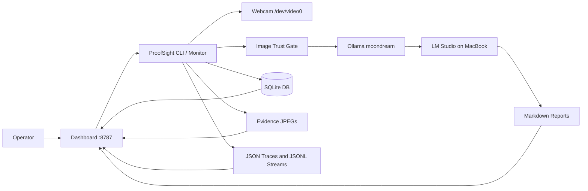
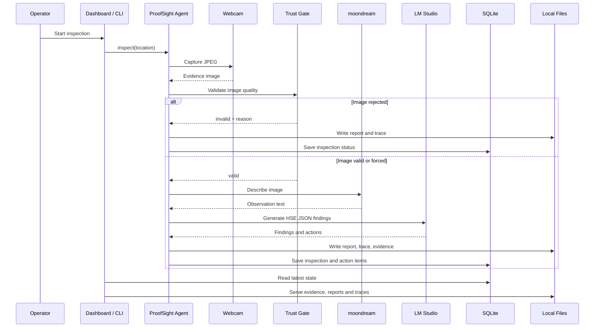

# System Architecture: ProofSight

## Overview

ProofSight is a local-first health and safety inspection appliance for a Raspberry Pi 5. It captures visual evidence from a webcam, validates whether that evidence is usable, runs local model analysis through Ollama, generates inspection reports and action items, and exposes the result through a local dashboard.

The current system is Scenario B: the camera, validation logic, Pi-local vision model, storage, traces, reports and dashboard run on the Pi, while reasoning/report decisions are configured to use LM Studio on a MacBook over Tailscale. If the MacBook LM Studio server is unreachable, ProofSight records `model_error` and keeps the inspection auditable instead of silently falling back or inventing findings.

ProofSight is designed as an evidence-led inspection assistant. It should reject unusable evidence rather than invent findings from dark, blank or obstructed frames.

## Key Requirements

- Run on a Raspberry Pi 5 with local storage.
- Capture evidence from a local webcam at `/dev/video0`.
- Validate evidence quality before model inference.
- Use local models through Ollama for the current deployment.
- Generate human-readable Markdown reports.
- Store inspection metadata and action items in SQLite.
- Keep evidence, traces and partner-aligned artifacts on-device.
- Provide a dashboard for operations, reporting, review and audit-pack export.
- Require human review before relying on AI-generated findings for formal compliance decisions.
- Keep evidence capture, validation, storage and dashboard local to the Pi, while allowing reasoning to run on a trusted MacBook over Tailscale.

## High-Level Architecture



The operator interacts with the dashboard or CLI. ProofSight captures an image, validates it, and only sends usable evidence to local models unless the `--force` option is used. Outputs are written to the local filesystem and SQLite database, then served back through the dashboard.

## Component Details

### ProofSight CLI and Monitor

- **Responsibilities:** Run one inspection, run repeated inspections, show partner status, initialise directories and database tables.
- **Main technologies:** Python 3.13, `argparse`, `sqlite3`, `subprocess`, `urllib.request`, PyYAML.
- **Data owned or transformed:** Inspection IDs, image paths, validation results, model responses, findings, reports and traces.
- **External dependencies:** `ffmpeg`, `v4l2-ctl`, Ollama HTTP API.
- **Failure modes or operational concerns:** Camera capture can fail, Ollama can be unavailable, local models can return unparseable JSON, and dark frames are intentionally rejected.

Main files:

```text
proofsight.py
vasper_qa.py
config.yaml
```

`proofsight.py` is the current command entry point. `vasper_qa.py` remains as the implementation and compatibility path.

### Camera Capture

- **Responsibilities:** Configure the webcam and capture one JPEG evidence frame.
- **Main technologies:** V4L2, `v4l2-ctl`, `ffmpeg`.
- **Data owned or transformed:** Raw camera frame saved as a JPEG evidence file.
- **External dependencies:** Local webcam at `/dev/video0`.
- **Failure modes or operational concerns:** Privacy shutter, low light, exposure settings, unavailable device, busy device or malformed camera output.

Current camera configuration:

```yaml
camera:
  device: /dev/video0
  width: 1280
  height: 720
  framerate: 10
  warm_frames: 20
  power_line_frequency: 1
```

### Image Trust Gate

- **Responsibilities:** Reject unusable evidence before model inference.
- **Main technologies:** Pillow image loading and statistics.
- **Data owned or transformed:** File size, resolution, mean RGB, pixel extrema, validity and rejection reason.
- **External dependencies:** None beyond local image file access.
- **Failure modes or operational concerns:** Thresholds may reject borderline low-light images. This is intentional for a trusted evidence workflow but may require tuning.

Current validation thresholds:

```yaml
validation:
  min_mean_brightness: 30
  min_file_size_bytes: 25000
  reject_blank_or_dark: true
```

Common rejection status:

```text
image_too_dark_or_obstructed
```

### Local Model Layer

- **Responsibilities:** Describe valid images and convert observations into structured HSE findings.
- **Main technologies:** Ollama HTTP API at `http://127.0.0.1:11434/api/generate`.
- **Data owned or transformed:** Image description text, structured JSON findings and action plans.
- **External dependencies:** Ollama service and installed local models.
- **Failure modes or operational concerns:** Slow inference on Pi CPU, unavailable model, timeout, unparseable JSON or hallucinated findings. The prompt instructs models not to invent hazards.

Current model configuration:

```yaml
models:
  scenario: B_pi_camera_macbook_lmstudio
  provider: lmstudio
  ollama_base_url: http://127.0.0.1:11434
  vision: moondream
  lmstudio_base_url: http://100.106.72.5:1234/v1
  reasoning: local-model
  report: local-model
```

### Report and Action Generation

- **Responsibilities:** Write Markdown inspection reports and save action items for visible findings.
- **Main technologies:** Python file writing, SQLite.
- **Data owned or transformed:** Markdown reports, findings JSON, action items.
- **External dependencies:** Local filesystem and SQLite database.
- **Failure modes or operational concerns:** Model findings may be incomplete or need human correction; report outputs are drafts.

Reports are stored in:

```text
/home/dave/hse-pi-agent/reports
```

### SQLite Data Store

- **Responsibilities:** Store canonical inspection rows, action items and dashboard review states.
- **Main technologies:** SQLite.
- **Data owned or transformed:** Inspections, action items and dashboard reviews.
- **External dependencies:** Local disk.
- **Failure modes or operational concerns:** No migration framework exists yet. Schema changes are currently created by application startup code.

Database path:

```text
/home/dave/hse-pi-agent/data/proofsight.db
```

### Dashboard and Reporting UI

- **Responsibilities:** Serve operations dashboard, reporting dashboard, evidence/report/trace views, review controls and audit-pack exports.
- **Main technologies:** Python standard library `ThreadingHTTPServer`.
- **Data owned or transformed:** HTML pages, JSON status payloads, CSV reports and ZIP exports.
- **External dependencies:** Local filesystem, SQLite, systemd service status.
- **Failure modes or operational concerns:** No authentication is currently implemented. The dashboard binds to `0.0.0.0:8787`, so it should only be used on trusted LAN or Tailscale networks.

Routes:

| Route | Purpose |
|---|---|
| `/` | Operations dashboard |
| `/reports` | Reporting dashboard |
| `/healthz` | Plain health check |
| `/api/status` | Service status, camera health, latest inspections, partner status |
| `/api/reports` | Reporting dataset as JSON |
| `/reports.csv` | Inspection CSV export |
| `/evidence/<file>` | Evidence image access |
| `/report/<file>` | Report viewer |
| `/trace/<file>` | Trace viewer |
| `/export/<inspection_id>` | Audit-pack ZIP export |

### Partner Adapter Layer

- **Responsibilities:** Keep sponsor-aligned integration claims explicit and machine-readable.
- **Main technologies:** Python, JSONL files, optional environment variables.
- **Data owned or transformed:** Partner status object, Cognee-style memory records, Overmind-style trace records.
- **External dependencies:** None required for the current local placeholder mode.
- **Failure modes or operational concerns:** Official SDK/API integrations are not active unless explicitly configured and tested.

Current partner status:

| Partner | Current implementation |
|---|---|
| Captur | Local image trust gate |
| Cognee | SQLite canonical memory plus JSONL ingest queue |
| Overmind | Local JSONL trace stream |
| Exo Labs | Configured slot only; local Ollama is active |
| Cosine | Engineering metadata only; not a runtime dependency |

## Data Flow



The trust gate is deliberately placed before expensive and uncertain model inference. Dark, blank or suspicious images are reported as rejected evidence rather than passed to the model pipeline by default.

## Data Model

### `inspections`

| Column | Purpose |
|---|---|
| `id` | Inspection ID, for example `HSE-YYYYMMDD-HHMMSS-XXXXXX` |
| `created_at` | UTC timestamp |
| `location` | Human-readable inspection location |
| `evidence_path` | Path to captured or supplied image |
| `valid_image` | Integer boolean image validation result |
| `image_validation_json` | JSON trust-gate metadata |
| `vision_text` | Vision model observation |
| `findings_json` | Structured findings and model metadata |
| `report_path` | Markdown report path |
| `trace_path` | JSON trace path |
| `status` | `image_rejected`, `no_finding` or `review_required` |

### `action_items`

| Column | Purpose |
|---|---|
| `id` | Action ID |
| `inspection_id` | Parent inspection |
| `title` | Finding title |
| `risk_level` | Low, medium, high or model-provided value |
| `responsible_role` | Role responsible for action |
| `deadline` | Recommended timeframe |
| `status` | Open, in progress, closed or reopened through dashboard |
| `details_json` | Full finding object |

### `reviews`

| Column | Purpose |
|---|---|
| `inspection_id` | Reviewed inspection |
| `status` | Approved, rejected or retake required |
| `note` | Optional review note |
| `updated_at` | Review timestamp |

### File Artifacts

| Path | Contents |
|---|---|
| `evidence/` | JPEG evidence images |
| `reports/` | Markdown inspection reports |
| `traces/` | JSON inspection traces and JSONL partner streams |
| `exports/` | Audit-pack ZIP files |
| `data/proofsight.db` | SQLite database |

## Infrastructure and Deployment

ProofSight runs as user-level systemd services on the Raspberry Pi.

### Inspection monitor service

```ini
ExecStart=/usr/bin/python3 /home/dave/hse-pi-agent/proofsight.py monitor --interval 300 --location "ProofSight webcam zone"
Restart=always
RestartSec=20
```

Unit path:

```text
/home/dave/.config/systemd/user/proofsight.service
```

### Dashboard service

```ini
ExecStart=/usr/bin/python3 /home/dave/hse-pi-agent/dashboard.py --host 0.0.0.0 --port 8787
Restart=always
RestartSec=10
```

Unit path:

```text
/home/dave/.config/systemd/user/proofsight-dashboard.service
```

### Dashboard endpoints

```text
http://127.0.0.1:8787
http://100.105.97.23:8787
http://10.101.151.73:8787
```

The public deployment model is `<ADD DETAIL>` if this project is published outside the local Pi/Tailscale environment.

## Scalability and Reliability

ProofSight is designed for a single edge device and a single local camera, not large multi-tenant scale.

Current reliability measures:

- systemd restarts the agent and dashboard services.
- Image validation prevents low-quality frames from generating misleading findings.
- Each inspection writes independent evidence, report and trace artifacts.
- SQLite stores canonical inspection and action data.
- Dashboard health and JSON API endpoints provide simple operational checks.

Known constraints:

- Pi CPU inference is slow for large prompts and valid-image inspections.
- The dashboard has no authentication.
- SQLite is local only and has no replication.
- There is no formal migration framework for database schema changes.
- The camera can return dark or obstructed frames; this is surfaced as a camera health issue.
- LM Studio over Tailscale is planned but not active until the MacBook server is reachable from the Pi.

## Security and Compliance

### Secrets management

The local Ollama vision step does not require API keys. LM Studio is expected to run on a trusted MacBook over Tailscale and normally accepts a dummy local bearer token. Optional partner endpoints may use environment variables, but no secrets should be committed into the repository.

### Client/server trust boundaries

The dashboard is served over plain HTTP on `0.0.0.0:8787`. It is intended for trusted local networks or Tailscale only. It should not be exposed to the public internet without authentication, authorisation and TLS.

### Authentication and authorisation

No dashboard authentication or role-based authorisation is currently implemented. Anyone who can reach the dashboard can view evidence, reports and traces, and can trigger dashboard actions.

### Sensitive data handling

Evidence images and inspection reports may contain workplace-sensitive visual information. They are stored on local disk under the project directory. Access should be controlled at the device, network and filesystem level.

### Third-party provider risk

Current sponsor integrations are local placeholder or adapter-ready layers unless explicitly configured. Captur, Cognee, Overmind, Exo Labs and Cosine are not currently active remote runtime dependencies in the current LM Studio/Tailscale setup.

### Auditability and logging

Each inspection writes:

- evidence image
- Markdown report
- JSON trace
- SQLite row
- Cognee-style JSONL memory record
- Overmind-style JSONL trace record

This supports local audit and debugging, but does not replace formal compliance recordkeeping.

## Observability

Current observability surfaces:

- systemd service status for `proofsight.service`, `proofsight-dashboard.service` and `ollama.service`.
- Dashboard health route at `/healthz`.
- Status API at `/api/status`.
- Reporting API at `/api/reports`.
- Per-inspection JSON traces in `traces/`.
- Partner JSONL streams:
  - `traces/cognee_ingest_queue.jsonl`
  - `traces/overmind_traces.jsonl`
- Markdown reports and audit-pack ZIP exports.

Useful commands:

```bash
systemctl --user status proofsight.service
systemctl --user status proofsight-dashboard.service
journalctl --user -u proofsight.service -f
journalctl --user -u proofsight-dashboard.service -f
curl http://127.0.0.1:8787/healthz
curl http://127.0.0.1:8787/api/status
```

## Design Decisions and Trade-offs

### Local-first processing

ProofSight keeps the inspection loop on the Pi so that evidence and reports can remain local. The trade-off is slower inference compared with a laptop, GPU workstation or cloud provider.

### Trust gate before model inference

The image validation layer rejects bad evidence before model inference. This improves trustworthiness and reduces wasted compute, but can reject borderline images if lighting is poor.

### SQLite and local files

SQLite plus local files are simple, inspectable and reliable for a single-device appliance. The trade-off is limited scalability, no built-in replication and manual backup requirements.

### Standard-library dashboard

The dashboard uses Python's standard library rather than FastAPI, Flask or React. This avoids dependency installation and keeps deployment simple on the Pi. The trade-off is less structure, less reusable UI code and limited security features.

### Adapter-ready sponsor integrations

The partner layer reports honest local status and emits artifacts that can later be consumed by official integrations. This avoids falsely claiming SDK usage, but means sponsor APIs are not yet active unless configured and verified.

### Human review requirement

Model output is treated as a draft. The dashboard includes review controls because HSE decisions need human oversight. The trade-off is that ProofSight is not fully autonomous for formal closure decisions.

## Future Improvements

- Add dashboard authentication and role-based access before any public exposure.
- Add a dependency manifest such as `requirements.txt` or `pyproject.toml`.
- Add automated tests for image validation, JSON parsing, database writes and dashboard endpoints.
- Add a migration mechanism for SQLite schema changes.
- Add LM Studio provider support over Tailscale for Scenario B.
- Add official Cognee ingestion if Cognee is installed and configured.
- Add official Captur, Overmind and Exo integrations only after SDK/API access is tested.
- Add a camera diagnostics page for exposure, shutter and lighting problems.
- Add backup and retention policy for evidence, reports, traces and database files.
- Add screenshots and a demo walkthrough for hackathon or portfolio review.
- Add a licence file and public contribution policy if the repository is published.
