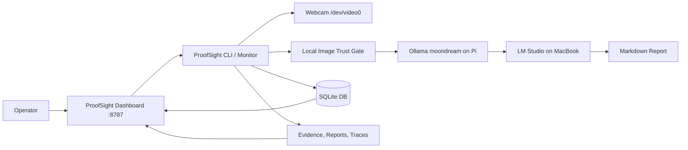

# ProofSight

Local trusted health and safety inspection agent for Raspberry Pi 5.

## Description

ProofSight is a local-first inspection appliance that captures workplace evidence from a webcam, validates whether the image is usable, analyses visible health and safety risks with local or LAN/Tailscale-hosted models, and produces reports, traces, action items and dashboard views.

The current deployment is Scenario B: the Raspberry Pi 5 keeps camera capture, evidence validation, dashboard, storage and Pi-local `moondream` vision, while HSE reasoning/report decisions are configured to use LM Studio on a MacBook over Tailscale. If LM Studio is not reachable, ProofSight records a `model_error` instead of inventing findings.

ProofSight is not a replacement for a competent human inspector. Its reports are draft inspection outputs and should be reviewed before they are used for formal compliance, legal or enforcement decisions.

## Table of Contents

- [Features](#features)
- [Tech Stack](#tech-stack)
- [Architecture Overview](#architecture-overview)
- [Installation](#installation)
- [Usage](#usage)
- [Configuration](#configuration)
- [Screenshots or Demo](#screenshots-or-demo)
- [CLI and Dashboard Reference](#cli-and-dashboard-reference)
- [Tests](#tests)
- [Roadmap](#roadmap)
- [Contributing](#contributing)
- [Licence](#licence)
- [Contact or Support](#contact-or-support)

## Features

- Webcam evidence capture through V4L2 and `ffmpeg`.
- Local image trust gate that rejects dark, blank or suspiciously small evidence.
- Local vision description using Ollama `moondream`.
- HSE reasoning and action-plan generation through LM Studio over Tailscale.
- Markdown inspection reports with image validation, summary and action plan sections.
- SQLite inspection memory with inspection and action item tables.
- JSON traces for each inspection.
- Partner-aligned artifact streams:
  - Captur-style local evidence validation.
  - Cognee-style JSONL memory ingest queue.
  - Overmind-style JSONL trace stream.
- Operations dashboard on port `8787`.
- Reporting dashboard with inspection counts, evidence quality, review state and CSV export.
- Audit-pack ZIP export containing evidence, report, trace and manifest.
- Human review controls for approving, rejecting or requesting a retake.
- Systemd user services for the inspection monitor and dashboard.

## Tech Stack

| Layer | Technology |
|---|---|
| Runtime | Python 3.13 |
| Hardware target | Raspberry Pi 5 |
| Camera | Logitech Brio / V4L2 device at `/dev/video0` |
| Capture | `ffmpeg`, `v4l2-ctl` |
| Image validation | Pillow |
| Local vision server | Ollama at `http://127.0.0.1:11434` |
| Vision model | `moondream` |
| Reasoning server | LM Studio at `http://100.106.72.5:1234/v1` over Tailscale |
| Reasoning/report model | `local-model` placeholder until LM Studio `/v1/models` exposes the exact model ID |
| Storage | SQLite and local files |
| Dashboard | Python standard library `http.server` |
| Service manager | systemd user services |

## Architecture Overview



The inspection monitor captures evidence from the webcam, validates it locally, and only sends usable images into the model pipeline. Vision currently runs on Pi-local Ollama, while reasoning/report decisions are configured for LM Studio on the MacBook over Tailscale. Reports, traces and action items are written to local storage, then surfaced through the dashboard and reporting views.

See [`ARCHITECTURE.md`](ARCHITECTURE.md) for the full system architecture, data flow, data model and trade-offs.

## Installation

This project is currently deployed in:

```bash
/home/dave/hse-pi-agent
```

Required system tools:

```bash
python3
ffmpeg
v4l2-ctl
systemctl --user
ollama
```

Required Python packages used by the application:

```text
PyYAML
Pillow
```

There is currently no committed `requirements.txt`. If recreating the project on a fresh machine, install Python dependencies in a virtual environment or through the system package manager used by the target device.

Example setup outline:

```bash
cd /home/dave/hse-pi-agent
python3 -m py_compile proofsight.py vasper_qa.py dashboard.py partners.py
```

Ensure Ollama is running and the required models are available:

```bash
systemctl --user status ollama.service
ollama list
```

Expected local Pi model for the current Scenario B vision step:

```text
moondream
```

The reasoning/report model is served by LM Studio on the MacBook. Replace `local-model` in `config.yaml` with the exact model ID returned by `http://100.106.72.5:1234/v1/models` once LM Studio is reachable.

## Usage

Run one inspection:

```bash
cd /home/dave/hse-pi-agent
./proofsight.py inspect --location "Warehouse aisle 1"
```

Use an existing image instead of capturing from the webcam:

```bash
./proofsight.py inspect \
  --image /home/dave/hse-pi-agent/evidence/example.jpg \
  --location "Existing evidence validation image"
```

Force analysis even when the trust gate rejects the image:

```bash
./proofsight.py inspect --location "Test area" --force
```

Show partner and sponsor adapter status:

```bash
./proofsight.py partners
```

Run repeated inspections:

```bash
./proofsight.py monitor --interval 300 --location "ProofSight webcam zone"
```

Start or inspect the systemd service:

```bash
systemctl --user daemon-reload
systemctl --user enable --now proofsight.service
systemctl --user status proofsight.service
journalctl --user -u proofsight.service -f
```

Start or inspect the dashboard service:

```bash
systemctl --user enable --now proofsight-dashboard.service
systemctl --user status proofsight-dashboard.service
journalctl --user -u proofsight-dashboard.service -f
```

## Configuration

Main configuration file:

```text
/home/dave/hse-pi-agent/config.yaml
```

Current model configuration:

```yaml
models:
  scenario: B_pi_camera_macbook_lmstudio
  provider: lmstudio
  ollama_base_url: http://127.0.0.1:11434
  vision: moondream
  lmstudio_base_url: http://100.106.72.5:1234/v1
  reasoning: local-model
  report: local-model
```

Camera configuration:

```yaml
camera:
  device: /dev/video0
  width: 1280
  height: 720
  framerate: 10
  warm_frames: 20
  power_line_frequency: 1
```

Validation configuration:

```yaml
validation:
  min_mean_brightness: 30
  min_file_size_bytes: 25000
  reject_blank_or_dark: true
```

File storage paths:

```yaml
actions:
  evidence_dir: /home/dave/hse-pi-agent/evidence
  reports_dir: /home/dave/hse-pi-agent/reports
  db_path: /home/dave/hse-pi-agent/data/proofsight.db
  trace_dir: /home/dave/hse-pi-agent/traces
```

Optional environment variables recognised by the partner adapter layer:

| Variable | Purpose | Required |
|---|---|---|
| `PROOFSIGHT_CAPTUR_COMMAND` | Optional external Captur SDK/CLI wrapper command | No |
| `PROOFSIGHT_OVERMIND_ENDPOINT` | Optional endpoint for exporting traces | No |
| `PROOFSIGHT_EXO_BASE_URL` | Optional Exo Labs or distributed inference endpoint | No |

No API keys are required for the current local Ollama vision step. LM Studio normally accepts a dummy local bearer token, but it must be reachable from the Pi over Tailscale or ProofSight will record `model_error` for reasoning.

## Screenshots or Demo

Dashboard URLs in the current Pi deployment:

```text
http://127.0.0.1:8787
http://100.105.97.23:8787
http://10.101.151.73:8787
```

Reporting dashboard:

```text
http://100.105.97.23:8787/reports
```

Health and API endpoints:

```text
http://127.0.0.1:8787/healthz
http://127.0.0.1:8787/api/status
http://127.0.0.1:8787/api/reports
http://127.0.0.1:8787/reports.csv
```

Screenshots are not currently committed. Add dashboard screenshots to a future `docs/` or `assets/` directory if this project is prepared for a public submission.

## CLI and Dashboard Reference

### CLI

```bash
./proofsight.py inspect --location "Warehouse aisle 1"
./proofsight.py inspect --image /path/to/image.jpg --location "Existing evidence"
./proofsight.py inspect --location "Test" --force
./proofsight.py monitor --interval 300 --location "Webcam area"
./proofsight.py partners
```

Compatibility command:

```bash
./vasper_qa.py inspect --location "Compatibility test"
```

### Dashboard routes

| Route | Purpose |
|---|---|
| `/` | Operations dashboard |
| `/reports` | Reporting dashboard |
| `/healthz` | Plain health check |
| `/api/status` | JSON status, camera health, latest inspections and partner status |
| `/api/reports` | JSON reporting dataset |
| `/reports.csv` | CSV export of inspections |
| `/evidence/<file>` | Evidence image access |
| `/report/<file>` | Markdown report viewer |
| `/trace/<file>` | JSON trace viewer |
| `/export/<inspection_id>` | Audit-pack ZIP export |

### Output files

| Directory | Contents |
|---|---|
| `evidence/` | Captured JPEG evidence |
| `reports/` | Markdown inspection reports |
| `traces/` | Per-inspection JSON traces and partner JSONL streams |
| `data/` | SQLite database |
| `exports/` | Audit-pack ZIP files |

## Tests

There is currently no formal test suite. Use the following smoke tests to verify the deployed system.

Compile Python files:

```bash
cd /home/dave/hse-pi-agent
python3 -m py_compile dashboard.py proofsight.py vasper_qa.py partners.py
```

Check services:

```bash
systemctl --user is-active proofsight.service
systemctl --user is-active proofsight-dashboard.service
systemctl --user is-active ollama.service
```

Check dashboard health:

```bash
curl http://127.0.0.1:8787/healthz
curl http://127.0.0.1:8787/api/status
curl http://127.0.0.1:8787/api/reports
```

Run a controlled inspection:

```bash
cd /home/dave/hse-pi-agent
./proofsight.py inspect --location "Smoke test"
```

A rejected dark image is a valid trust-gate result, not a software crash. The typical status for a dark or obstructed frame is:

```text
image_rejected
image_too_dark_or_obstructed
```

## Roadmap

- Add a committed dependency file, for example `requirements.txt` or `pyproject.toml`.
- Add automated unit tests for image validation, JSON parsing, report writing and dashboard routes.
- Add authentication for the dashboard before exposing it beyond trusted LAN or Tailscale networks.
- Replace the temporary `local-model` LM Studio model ID with the exact model ID once `/v1/models` is reachable.
- Add a real official Cognee ingestion worker if Cognee is installed and configured.
- Add official Captur, Overmind or Exo integrations when tested SDKs or endpoints are available.
- Add dashboard screenshots and demo media.
- Improve camera diagnostics for privacy shutter, exposure and lighting issues.

## Contributing

This project is currently a local prototype rather than a public open-source repository. If it is published, suggested contribution areas are:

- image validation tests
- dashboard UX improvements
- LM Studio provider adapter
- official sponsor integrations
- documentation and deployment hardening

## Licence

<ADD LICENSE>

No licence file was found in the inspected project directory.

## Contact or Support

Maintainer: Dave Cheng

Contact: <ADD PUBLIC CONTACT>
