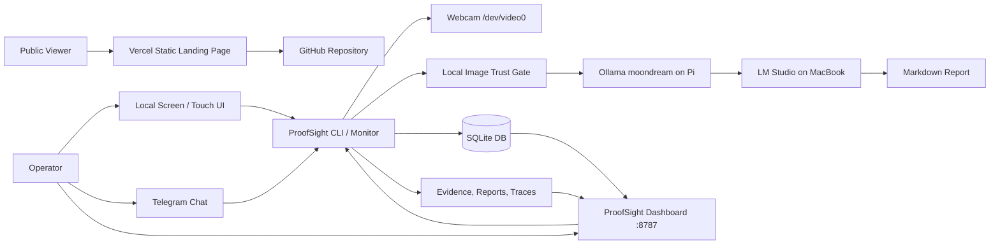
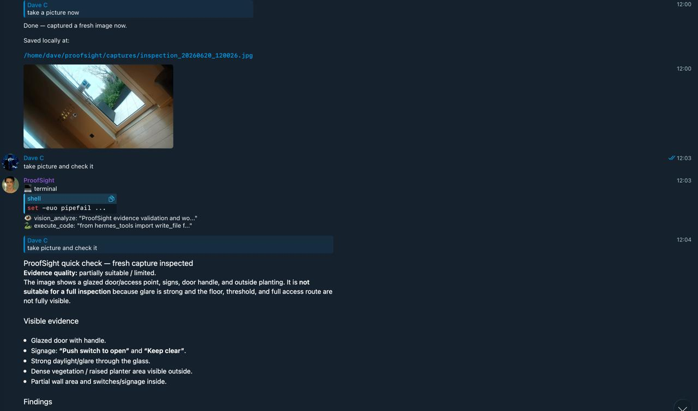
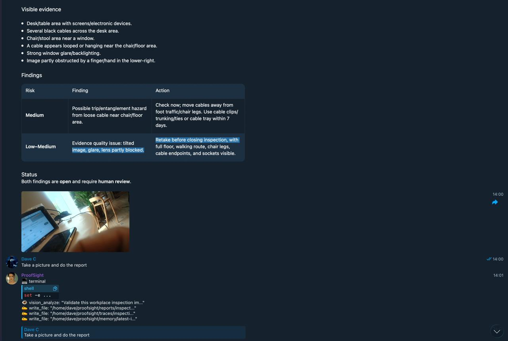
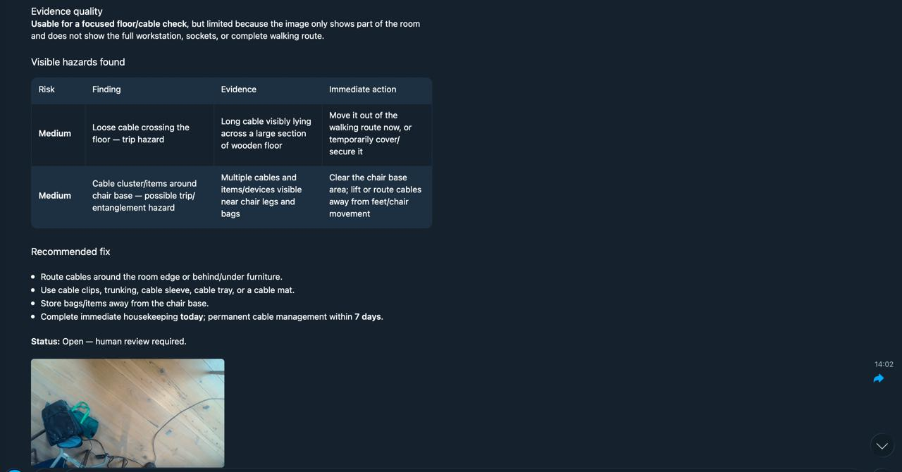

# ProofSight

Local-first autonomous AI health and safety inspection agent for Raspberry Pi 5.

## Description

ProofSight is a Raspberry Pi 5 inspection appliance for building a self-contained autonomous AI agent: webcam evidence capture, on-device evidence validation, local memory, inspection decisions, task execution, reports, traces, action items and dashboard views. The intended physical product is a Pi5 box with a screen and webcam that can operate from local controls, dashboard, or Telegram.

ProofSight now works directly from Telegram in the current deployment. A user can send plain-language requests such as `take picture and check it` or `Take a picture and do the report`; the Pi captures a fresh webcam image, runs the evidence trust check, analyses visible hazards, and returns inspection findings or a short report back in the chat.

The current deployment keeps camera capture, image validation, evidence storage, reports, traces, dashboard, Telegram operation, local memory and Pi-local `moondream` vision on the Raspberry Pi. HSE reasoning and report decisions are currently configured to use LM Studio on a MacBook over Tailscale. The project direction is to move reasoning and task execution fully onto the Pi5 where practical, so the deployed appliance can operate self-contained. If LM Studio or any model dependency is unreachable, ProofSight records `model_error` rather than inventing findings.

In short: **current system = Pi-first with MacBook reasoning assist**, **target system = fully self-contained Pi5 autonomous inspection appliance with screen + webcam**.

ProofSight is an inspection assistant, not a replacement for a competent human inspector. Reports are draft outputs and should be reviewed before formal compliance, legal or enforcement use.

## Table of Contents

- [Features](#features)
- [Tech Stack](#tech-stack)
- [Architecture Overview](#architecture-overview)
- [Sponsor and Partner Integration Status](#sponsor-and-partner-integration-status)
- [Installation](#installation)
- [Usage](#usage)
- [Configuration](#configuration)
- [Screenshots or Demo](#screenshots-or-demo)
- [API and CLI Reference](#api-and-cli-reference)
- [Tests](#tests)
- [Roadmap](#roadmap)
- [Contributing](#contributing)
- [Licence](#licence)
- [Contact or Support](#contact-or-support)

## Features

- Telegram-first operation for live inspection requests from chat.
- Designed for a self-contained Pi5 appliance with local screen, webcam and dashboard controls.
- Autonomous inspection loop: capture evidence, validate it, recall memory, generate findings, create actions and await human review.
- Webcam evidence capture through V4L2 and `ffmpeg`.
- Local image trust gate that rejects dark, blank, obstructed or suspiciously small evidence.
- Pi-local vision description through Ollama `moondream`.
- HSE reasoning and action-plan generation through LM Studio over Tailscale.
- Markdown inspection reports with validation, summary, findings and action-plan sections.
- SQLite inspection memory with inspection, action item and review tables.
- JSON trace file for each inspection.
- Partner-aligned artifact streams:
  - Captur-style local evidence validation.
  - Cognee-style JSONL memory ingest queue.
  - Overmind-style JSONL trace stream.
- Operations dashboard on port `8787`.
- Reporting dashboard with inspection counts, evidence quality, review state and CSV export.
- Audit-pack ZIP export containing evidence, report, trace and manifest.
- Human review controls for approving, rejecting or requesting a retake.
- Systemd user services for the inspection monitor and dashboard.
- Static public landing page configured for Vercel deployment.

## Tech Stack

| Layer | Technology |
|---|---|
| Runtime | Python 3.13 |
| Hardware target | Raspberry Pi 5 appliance with webcam and optional local screen/touch display |
| Camera | Logitech Brio / V4L2 device at `/dev/video0` |
| Capture tools | `ffmpeg`, `v4l2-ctl` |
| Image validation | Pillow |
| Local vision server | Ollama at `http://127.0.0.1:11434` |
| Vision model | `moondream` |
| Reasoning server | Current: LM Studio at `http://<MACBOOK_TAILSCALE_IP>:1234/v1` over Tailscale. Target: Pi-local reasoning model/service. |
| Reasoning/report model | Current: `local-model` placeholder until LM Studio exposes the exact model ID. Target: Pi-local small reasoning model. |
| Storage | SQLite and local files |
| Dashboard | Python standard library `ThreadingHTTPServer` |
| Chat operation | Telegram via Hermes/gateway routing to the Pi runtime |
| Service manager | systemd user services |
| Public landing page | Static HTML in `public/index.html`, Vercel config in `vercel.json` |
| Node tooling | Node.js 22.22.3, npm 10.9.8 for the static Vercel build script |

## Architecture Overview



The inspection appliance runs on the Raspberry Pi. It captures evidence, validates the image locally, sends only usable evidence into the model pipeline, stores reports and traces on disk, and exposes local dashboard views. The intended hardware form is a Pi5 with webcam and screen for local operation; Telegram remains a remote-control channel. The Vercel site is only a public project page; it does not expose the Pi camera, SQLite database or local dashboard controls.

### Self-contained Pi5 appliance target

ProofSight is being shaped as an autonomous local agent rather than a cloud SaaS workflow. The appliance target is:

- **Input:** attached webcam, local screen/touch UI, dashboard controls and Telegram commands.
- **Decision loop:** validate evidence, recall previous hazards, analyse the scene, draft findings, create action items, and ask for human review where required.
- **Execution loop:** write local reports, update SQLite, append trace/memory streams, expose dashboard/API state, and package audit evidence.
- **Data boundary:** keep evidence, reports, traces, action history and memory on the Pi unless an optional adapter is explicitly configured.
- **Model boundary:** current reasoning can use MacBook LM Studio over Tailscale; the target is Pi-local reasoning so all process, decision-making and task execution can happen on-device.

See [`ARCHITECTURE.md`](ARCHITECTURE.md) for the full system architecture, data flow, data model and trade-offs.

## Sponsor and Partner Integration Status

ProofSight does **not** claim that every sponsor is already integrated through an official SDK or hosted API. The current project uses sponsors in three different ways:

1. **Implemented local equivalents:** functionality exists in the ProofSight runtime today.
2. **Adapter-ready artifact streams:** ProofSight writes local files in a shape that an official integration could consume later.
3. **Future or process-layer usage:** the sponsor fits the product architecture, but is not part of the live runtime yet.

That distinction matters because ProofSight is safety-adjacent. A judge, maintainer or inspector should be able to tell the difference between live behaviour, local prototype behaviour and planned integration.

| Sponsor / partner | Does ProofSight really use it today? | Who uses it? | How it is used | Why it belongs in ProofSight |
|---|---|---|---|---|
| Captur | Yes, as a local Captur-style evidence trust gate. No official Captur SDK is active yet. | The ProofSight inspection agent uses it before model inference; the human reviewer benefits from knowing bad evidence was rejected. | The runtime checks image file size, resolution, brightness and pixel extrema. Dark, blank, obstructed or suspiciously small images are rejected with reasons such as `image_too_dark_or_obstructed`. | H&S findings are only useful if the evidence is trustworthy. The product should refuse to invent hazards from unusable images. |
| Cognee | Yes as local memory and Cognee-style artifacts; optional official SDK/API adapter is now present but not enabled by default. | The agent uses SQLite memory during report generation; the dashboard shows memory stats; `cognee_adapter.py` can consume the JSONL queue with the official Cognee SDK/API when installed and configured. | Each inspection is stored in SQLite, compared against previous findings for recurrence, included in report Memory Context, appended as schema v2 records to `traces/cognee_ingest_queue.jsonl`, and can be sent to Cognee via `cognee.remember(...)`. | Safety agents need memory of previous hazards, repeated locations, action history and review outcomes. |
| Overmind | Partly. ProofSight emits local Overmind-style traces; no official Overmind endpoint is active unless configured. | The maintainer, reviewer or future improvement loop uses the traces to inspect agent behaviour. | Each inspection appends structured trace data to `traces/overmind_traces.jsonl`, including validation results, model outputs, provider errors and review requirements. | Autonomous agents need inspectable reasoning and failure trails, especially when decisions affect safety workflows. |
| Exo Labs | Not active in the current runtime. ProofSight is designed with an adapter slot for future distributed local inference. | A future deployment operator would use it when the Pi needs help from another trusted local compute node. | Current inference uses Pi-local Ollama for vision and MacBook LM Studio for reasoning. Exo can be wired later through `PROOFSIGHT_EXO_BASE_URL`. | The Pi is excellent as the always-on appliance, but heavier models may need more compute without turning the product into cloud SaaS. |
| Cosine | Not a runtime integration. It is a development and code-review lane. | The developer or reviewer uses it to improve the implementation, tests and reliability. | Cosine is documented as an engineering-quality partner lane rather than being called by the inspection agent. | Safety-adjacent code needs stronger review discipline, test coverage and implementation quality. |

In short: **Captur-style validation is live**, **Cognee-style local memory and JSONL export are live**, **Overmind-style trace export is live**, **Exo is future adapter-ready**, and **Cosine is a build/review process fit rather than a runtime dependency**.

### Cognee-style memory now implemented

ProofSight now uses local memory during the inspection workflow, not only after it. For each inspection it:

- stores the inspection and action items in SQLite
- extracts hazard categories such as `trip_hazard`, `electrical_hazard` and `housekeeping`
- compares new findings with previous inspections to detect similar hazards
- adds a **Memory Context** section to generated reports
- exposes memory counts and recurring hazard categories on the dashboard and `/api/status`
- writes schema v2 Cognee-style records to `traces/cognee_ingest_queue.jsonl`

This means Cognee is represented as a working local memory layer now, with an honest optional path to official Cognee SDK/API ingestion.

#### Optional official Cognee SDK/API bridge

ProofSight includes `cognee_adapter.py`, an optional bridge that reads `traces/cognee_ingest_queue.jsonl` and sends memory records to Cognee with the official Python SDK when installed. The adapter intentionally imports Cognee lazily so the core Pi inspection agent still runs when Cognee is absent.

Audit finding: Cognee `main`/PyPI is currently `1.1.3`; upstream `dev` is `1.2.0.dev1` and includes the newer memory API (`remember`, `recall`, `forget`, `improve`). ProofSight supports `remember(...)` when available and falls back to `add(...)` + `cognify(...)` for older SDKs.

Safe dry-run, no Cognee install required:

```bash
cd /home/dave/hse-pi-agent
python3 cognee_adapter.py --dry-run --limit 3
```

Recommended isolated install path if enabling official Cognee locally:

```bash
cd /home/dave/hse-pi-agent
uv venv .venv-cognee
. .venv-cognee/bin/activate
uv pip install cognee==1.1.3
python cognee_adapter.py --dry-run --limit 3
```

Cloud/API mode uses environment variables, not committed secrets:

```bash
export COGNEE_SERVICE_URL="https://your-instance.cognee.ai"
export COGNEE_API_KEY="..."
python cognee_adapter.py --limit 20
```

Do not paste Cognee API keys into the repo, reports, traces, or chat.

## Installation

This project is currently deployed in:

```bash
/home/dave/hse-pi-agent
```

Required system tools:

```bash
python3
ffmpeg
v4l2-ctl
systemctl --user
ollama
```

Required Python packages used by the application:

```text
PyYAML
Pillow
```

There is currently no committed `requirements.txt` or `pyproject.toml`. If recreating the project on a fresh machine, install Python dependencies in a virtual environment or through the system package manager used by the target device.

Clone and verify the repository:

```bash
git clone git@github.com:MasteraSnackin/ProofSight.git
cd ProofSight
python3 -m py_compile proofsight.py vasper_qa.py dashboard.py partners.py camera_test.py
```

For the existing Pi deployment:

```bash
cd /home/dave/hse-pi-agent
python3 -m py_compile proofsight.py vasper_qa.py dashboard.py partners.py camera_test.py
```

Ensure Ollama is running and the required local vision model is available:

```bash
systemctl --user status ollama.service
ollama list
```

Expected Pi-local model:

```text
moondream
```

The reasoning/report model is served by LM Studio on the MacBook. Replace `local-model` in `config.yaml` with the exact model ID returned by `http://<MACBOOK_TAILSCALE_IP>:1234/v1/models` once LM Studio is reachable.

## Usage

### Telegram operation

ProofSight now works directly from Telegram in the current deployment. The operator can ask for inspections in plain English and receive the result back in the same chat.

Example Telegram requests:

```text
take picture and check it
Take a picture and do the report
check the webcam for hazards
```

What happens behind the scenes:

1. Telegram message reaches the Pi through the Hermes/gateway routing layer.
2. ProofSight captures a fresh webcam image or uses the supplied evidence image.
3. The image trust gate checks whether the evidence is usable.
4. Valid evidence is analysed for visible health and safety hazards.
5. ProofSight replies with findings, evidence limitations, recommended actions or a short inspection report.
6. Evidence, reports, traces and memory records are still stored locally on the Pi.

### CLI operation

Run one inspection:

```bash
cd /home/dave/hse-pi-agent
./proofsight.py inspect --location "Warehouse aisle 1"
```

Use an existing image instead of capturing from the webcam:

```bash
./proofsight.py inspect \
  --image /home/dave/hse-pi-agent/evidence/example.jpg \
  --location "Existing evidence validation image"
```

Force analysis even when the trust gate rejects the image:

```bash
./proofsight.py inspect --location "Test area" --force
```

Show partner and sponsor adapter status:

```bash
./proofsight.py partners
```

Run repeated inspections:

```bash
./proofsight.py monitor --interval 300 --location "ProofSight webcam zone"
```

Start or inspect the systemd service:

```bash
systemctl --user daemon-reload
systemctl --user enable --now proofsight.service
systemctl --user status proofsight.service
journalctl --user -u proofsight.service -f
```

Start or inspect the dashboard service:

```bash
systemctl --user enable --now proofsight-dashboard.service
systemctl --user status proofsight-dashboard.service
journalctl --user -u proofsight-dashboard.service -f
```

Build the static public landing page:

```bash
npm run build
```

Deploy the public landing page to Vercel after authenticating the Vercel CLI:

```bash
npx vercel@54.14.2 login
npx vercel@54.14.2 deploy --prod --yes
```

## Configuration

Main configuration file:

```text
/home/dave/hse-pi-agent/config.yaml
```

Current model configuration:

```yaml
models:
  scenario: B_pi_camera_macbook_lmstudio
  provider: lmstudio
  ollama_base_url: http://127.0.0.1:11434
  vision: moondream
  lmstudio_base_url: http://<MACBOOK_TAILSCALE_IP>:1234/v1
  reasoning: local-model
  report: local-model
```

Camera configuration:

```yaml
camera:
  device: /dev/video0
  width: 1280
  height: 720
  framerate: 10
  warm_frames: 20
  power_line_frequency: 1
```

Validation configuration:

```yaml
validation:
  min_mean_brightness: 30
  min_file_size_bytes: 25000
  reject_blank_or_dark: true
```

File storage paths:

```yaml
actions:
  evidence_dir: /home/dave/hse-pi-agent/evidence
  reports_dir: /home/dave/hse-pi-agent/reports
  db_path: /home/dave/hse-pi-agent/data/proofsight.db
  trace_dir: /home/dave/hse-pi-agent/traces
```

Optional environment variables recognised by the partner adapter layer:

| Variable | Purpose | Required |
|---|---|---|
| `PROOFSIGHT_CAPTUR_COMMAND` | Optional external Captur SDK/CLI wrapper command | No |
| `PROOFSIGHT_OVERMIND_ENDPOINT` | Optional endpoint for exporting traces | No |
| `PROOFSIGHT_EXO_BASE_URL` | Optional Exo Labs or distributed inference endpoint | No |

No API keys are required for the current local Ollama vision step. LM Studio normally accepts a dummy local bearer token, but it must be reachable from the Pi over Tailscale or ProofSight will record `model_error` for reasoning.

## Screenshots or Demo

ProofSight is operated from Telegram in the current Raspberry Pi deployment. The screenshots below show the appliance responding to plain-language inspection requests, capturing fresh webcam evidence, checking whether the image is usable, identifying visible hazards and producing action-oriented inspection text.

### Demo 1: take a picture and check it

User request:

```text
take picture and check it
```

ProofSight captured a fresh image from the connected camera, inspected it, and reported that the evidence was only partially suitable because glare, floor threshold visibility and the full access route were limited. It still listed visible evidence such as the glazed door, signage, daylight/glare and surrounding access area, while flagging the evidence-quality limitation for review.



### Demo 2: cable and workstation hazard check

This demo shows ProofSight identifying visible desk/workstation risks from camera evidence:

- desk or table area with screens and electronic devices
- several black cables across the desk area
- chair or stool area near a window
- cable near the chair/floor area
- strong window glare/backlighting
- image partly obstructed by a hand or finger

Findings included a possible trip or entanglement hazard from loose cable near the chair/floor area, plus an evidence-quality issue requiring a retake before closing the inspection.



### Demo 3: take a picture and do the report

User request:

```text
Take a picture and do the report
```

ProofSight captured a floor/cable image and generated a short inspection report. The report marked the evidence as usable for a focused floor/cable check, then identified visible medium-risk hazards:

| Risk | Finding | Evidence | Immediate action |
|---|---|---|---|
| Medium | Loose cable crossing the floor — trip hazard | Long cable visibly lying across a large section of wooden floor | Move it out of the walking route now, or temporarily cover/secure it |
| Medium | Cable cluster/items around chair base — possible trip/entanglement hazard | Multiple cables and items/devices visible near chair legs and bags | Clear the chair base area; lift or route cables away from feet/chair movement |

Recommended fix:

- Route cables around the room edge or behind/under furniture.
- Use cable clips, trunking, cable sleeve, cable tray or a cable mat.
- Store bags/items away from the chair base.
- Complete immediate housekeeping today; permanent cable management within 7 days.

Status: open, with human review required.



### Local and public demo URLs

Local dashboard URLs in the current Pi deployment:

```text
http://127.0.0.1:8787
http://<PI_TAILSCALE_IP>:8787
http://<PI_LAN_IP>:8787
```

Reporting dashboard:

```text
http://<PI_TAILSCALE_IP>:8787/reports
```

Health and API endpoints:

```text
http://127.0.0.1:8787/healthz
http://127.0.0.1:8787/api/status
http://127.0.0.1:8787/api/reports
http://127.0.0.1:8787/reports.csv
```

Public landing page:

```text
<ADD VERCEL URL>
```

## API and CLI Reference

### CLI

```bash
./proofsight.py inspect --location "Warehouse aisle 1"
./proofsight.py inspect --image /path/to/image.jpg --location "Existing evidence"
./proofsight.py inspect --location "Test" --force
./proofsight.py monitor --interval 300 --location "Webcam area"
./proofsight.py partners
```

Compatibility command:

```bash
./vasper_qa.py inspect --location "Compatibility test"
```

### Dashboard routes

| Route | Purpose |
|---|---|
| `/` | Operations dashboard |
| `/reports` | Reporting dashboard |
| `/healthz` | Plain health check |
| `/api/status` | JSON status, camera health, latest inspections and partner status |
| `/api/reports` | JSON reporting dataset |
| `/reports.csv` | CSV export of inspections |
| `/evidence/<file>` | Evidence image access |
| `/report/<file>` | Markdown report viewer |
| `/trace/<file>` | JSON trace viewer |
| `/export/<inspection_id>` | Audit-pack ZIP export |

### Output files

| Directory | Contents |
|---|---|
| `evidence/` | Captured JPEG evidence |
| `reports/` | Markdown inspection reports |
| `traces/` | Per-inspection JSON traces and partner JSONL streams |
| `data/` | SQLite database |
| `exports/` | Audit-pack ZIP files |

## Tests

There is currently no formal test suite. Use the following smoke tests to verify the deployed system.

Compile Python files:

```bash
cd /home/dave/hse-pi-agent
python3 -m py_compile dashboard.py proofsight.py vasper_qa.py partners.py camera_test.py
```

Run the static landing page build check:

```bash
npm run build
```

Check services:

```bash
systemctl --user is-active proofsight.service
systemctl --user is-active proofsight-dashboard.service
systemctl --user is-active ollama.service
```

Check dashboard health:

```bash
curl http://127.0.0.1:8787/healthz
curl http://127.0.0.1:8787/api/status
curl http://127.0.0.1:8787/api/reports
```

Run a controlled inspection:

```bash
cd /home/dave/hse-pi-agent
./proofsight.py inspect --location "Smoke test"
```

A rejected dark image is a valid trust-gate result, not a software crash. The typical status for a dark or obstructed frame is:

```text
image_rejected
image_too_dark_or_obstructed
```

## Roadmap

- Add a committed dependency file, for example `requirements.txt` or `pyproject.toml`.
- Add automated unit tests for image validation, JSON parsing, report writing and dashboard routes.
- Add authentication for the dashboard before exposing it beyond trusted LAN or Tailscale networks.
- Replace the temporary `local-model` LM Studio model ID with the exact model ID once `/v1/models` is reachable.
- Complete Vercel authentication and replace `<ADD VERCEL URL>` with the live public landing page URL.
- Add a real official Cognee ingestion worker if Cognee is installed and configured.
- Add official Captur, Overmind or Exo integrations when tested SDKs or endpoints are available.
- Add dashboard screenshots and demo media.
- Improve camera diagnostics for privacy shutter, exposure and lighting issues.

## Contributing

This project is currently a local prototype rather than a mature public open-source project. If it is published for wider contribution, useful areas include:

- image validation tests
- dashboard UX improvements
- LM Studio provider adapter hardening
- official sponsor integrations
- documentation and deployment hardening
- dashboard authentication and access control

## Licence

<ADD LICENSE>

No licence file was found in the inspected project directory.

## Contact or Support

Maintainer: Dave Cheng

Contact: <ADD PUBLIC CONTACT>
