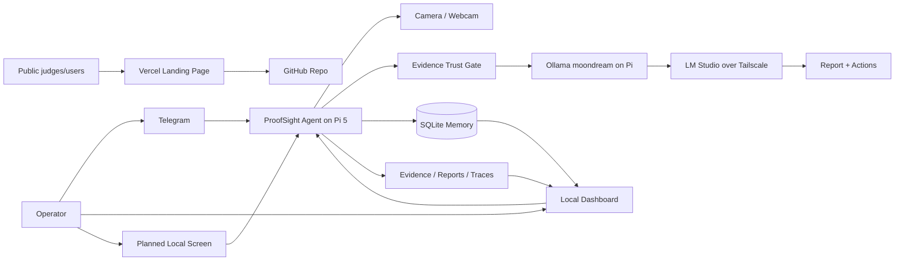

# ProofSight Submission Report

**Submission due:** Sunday 28 June 2026  
**Project:** ProofSight  
**Tagline:** A local-first Raspberry Pi 5 health and safety inspection agent that captures trusted evidence, flags visible hazards, remembers recurring risks and produces auditable reports.

## Links

| Item | Link |
|---|---|
| GitHub repository | https://github.com/MasteraSnackin/ProofSight |
| Public live landing page | https://hse-pi-agent.vercel.app/ |
| Demo video | https://github.com/MasteraSnackin/ProofSight/blob/main/docs/assets/proofsight-demo-video.mp4 |
| Demo screenshots | https://github.com/MasteraSnackin/ProofSight/tree/main/docs/assets |
| Architecture document | https://github.com/MasteraSnackin/ProofSight/blob/main/ARCHITECTURE.md |
| README / setup guide | https://github.com/MasteraSnackin/ProofSight/blob/main/README.md |

> Note: the live Vercel page is a public project landing page. The operational dashboard runs on the Raspberry Pi on a private LAN/Tailscale address because it exposes local inspection state and currently has no public authentication layer.

## Executive summary

ProofSight is a Raspberry Pi 5 inspection appliance for small workplaces and site teams. It uses a local camera to capture evidence, checks whether the image is good enough to trust, analyses visible health and safety risks, creates draft inspection reports and action items, stores local memory, and keeps a human reviewer in the loop.

The project is designed around a simple safety principle: **if the evidence is bad, the agent should refuse to make confident findings.** This makes ProofSight different from a generic image chatbot. It is built as an inspectable field device with evidence, reports, traces, review state and audit exports rather than as a black-box cloud workflow.

## Problem

Small sites often rely on ad-hoc checks, photos in chat threads and manual notes. That creates three problems:

1. Evidence quality is inconsistent.
2. Repeated hazards are easy to miss.
3. Reports and corrective actions are not always tied back to the original evidence.

ProofSight addresses this by making the capture, trust check, analysis, report and review workflow one repeatable local loop.

## What ProofSight does in the wild

A user can message the Telegram-operated ProofSight agent with a request such as:

```text
take picture and check it
```

or:

```text
Take a picture and do the report
```

The Pi then:

1. Captures a fresh image from the connected camera.
2. Runs a local evidence trust gate.
3. Rejects dark, blank, obstructed or suspiciously small images.
4. Uses Pi-local vision to describe visible scene evidence.
5. Uses a reasoning step to draft health and safety findings and action items.
6. Checks local memory for similar previous hazards.
7. Saves a Markdown report, JSON trace, SQLite inspection record and action items.
8. Returns a short inspection summary to the operator.
9. Leaves the result open for human review before formal use.

Example hazards handled by the demo include loose cable trip hazards, partially obstructed routes, workstation cable clutter, glare/poor evidence quality, and retake-required cases.

## Core features

- Telegram-first inspection requests from plain language.
- Raspberry Pi 5 local runtime with evidence, memory, reports and dashboard state stored on device.
- Camera evidence capture through V4L2/ffmpeg.
- Evidence trust gate that refuses unusable images.
- Pi-local `moondream` vision through Ollama.
- Reasoning/report generation through LM Studio over Tailscale in the current deployment.
- SQLite inspection memory and recurring hazard lookup.
- Markdown reports, JSON traces and action items.
- Local dashboard on port `8787` for reports, status, CSV export and audit-pack export.
- Human review workflow for approving, rejecting or requesting retakes.
- Public static landing page deployed on Vercel.

## Architecture

ProofSight separates the public project surface from the private operational system.



Current deployment:

- The Raspberry Pi owns the camera, validation, storage, reports, traces, dashboard and Telegram operation.
- The MacBook LM Studio service is currently used as a trusted Tailscale reasoning assist.
- The target direction is to move reasoning fully onto the Pi where practical, making the whole inspection loop self-contained.

## Safety and reliability choices

ProofSight intentionally fails closed:

- Bad images are rejected instead of analysed.
- Model/provider failures are recorded as `model_error` instead of silently faking results.
- Reports are drafts requiring human review.
- The private dashboard is not exposed as the public live link because it has no authentication layer yet.
- Sponsor/partner claims are documented honestly as live, local equivalent, adapter-ready or future work.

## Sponsor and integration honesty

| Partner / concept | Current status |
|---|---|
| Captur-style evidence validation | Live as a local evidence trust gate. Official SDK not active. |
| Cognee-style memory | Live as SQLite recurrence lookup and JSONL memory queue. Optional official SDK adapter exists but is not enabled by default. |
| Overmind-style traces | Live as local JSON/JSONL traces for inspection behaviour and failures. |
| Exo Labs | Future adapter slot for distributed local inference; not active in the current runtime. |
| Cosine | Process/development fit for code quality and review, not a runtime dependency. |

## Demo assets

The repository contains three Telegram demo screenshots and a short MP4 demo video assembled from those screenshots:

- `docs/assets/proofsight-telegram-capture-check.jpg`
- `docs/assets/proofsight-telegram-desk-check.jpg`
- `docs/assets/proofsight-telegram-report.jpg`
- `docs/assets/proofsight-demo-video.mp4`

The screenshots show ProofSight responding to inspection requests, checking evidence quality, identifying visible hazards and producing action-oriented report text.

## What is live now

- GitHub repository with source, README, architecture document and assets.
- Public Vercel landing page.
- Raspberry Pi local runtime structure.
- Telegram-oriented inspection workflow in the deployed Pi setup.
- Local reports, traces, SQLite memory and dashboard code.

## Known limitations and next steps

- The live Pi dashboard is private because it currently has no public authentication layer.
- Camera availability depends on the attached webcam/camera being present and recognised by the Pi.
- Current reasoning uses MacBook LM Studio over Tailscale; moving reasoning fully onto the Pi is the main product-hardening step.
- Add a local screen/touch UI for the physical appliance form factor.
- Add authenticated remote dashboard access if the live operational dashboard needs to be judge-accessible.
- Expand tests around camera failure modes, validation thresholds and report memory.

## Final submission note

ProofSight is not presented as a certified inspector. It is a local-first inspection assistant that captures evidence, refuses weak evidence, drafts findings, remembers repeat hazards and produces auditable outputs for human review.
